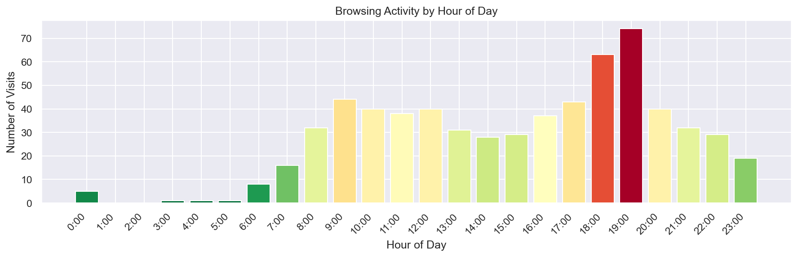
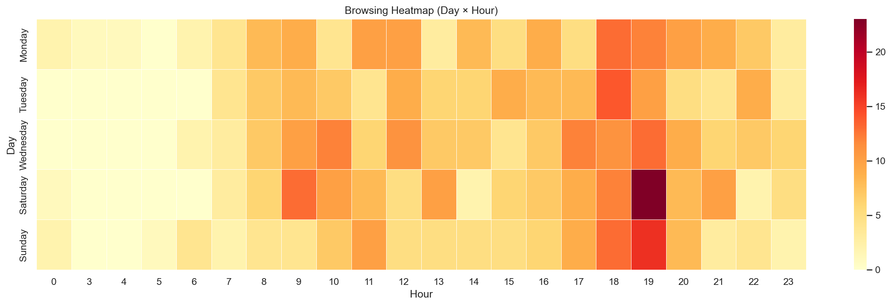
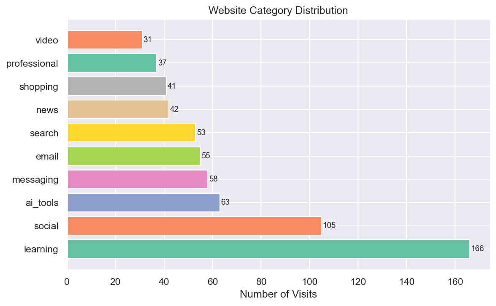
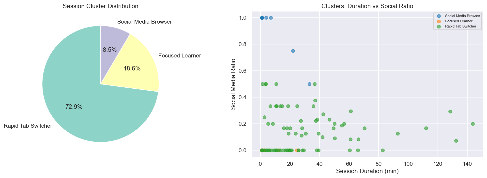
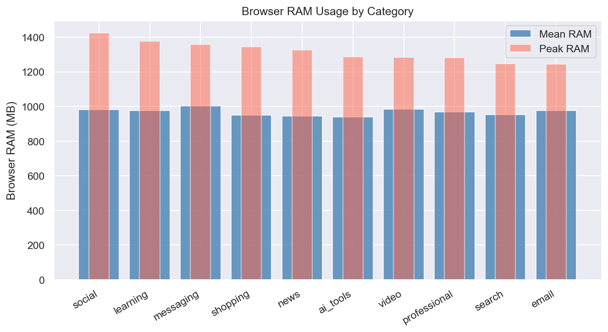

# DS105 Final Project Report
## Time-Based Browsing Pattern Analyzer with RAM Correlation

**Generated:** 2026-03-05 07:58
**Analysis Window:** Last 5 days

---

## 1. Overview

- **Total page visits analyzed:** 651
- **Unique domains:** 25
- **Categories found:** social, professional, news, email, learning, search, ai_tools, video, messaging, shopping

## 2. Top Websites / Domains

| Rank | Domain | Visits |
|------|--------|--------|
| 1 | stackoverflow.com | 43 |
| 2 | whatsapp.com | 39 |
| 3 | linkedin.com | 37 |
| 4 | github.com | 34 |
| 5 | kaggle.com | 32 |
| 6 | google.com | 32 |
| 7 | claude.ai | 32 |
| 8 | medium.com | 31 |
| 9 | chatgpt.com | 31 |
| 10 | reddit.com | 31 |

## 3. Hourly & Day-wise Usage Patterns

- **Peak browsing hour:** 19:00 (74 visits)
- **Quietest hour:** 3:00

## 4. Category Analysis

| Category | Share (%) |
|----------|-----------|
| learning | 25.5% |
| social | 16.1% |
| ai_tools | 9.7% |
| messaging | 8.9% |
| email | 8.4% |
| search | 8.1% |
| news | 6.5% |
| shopping | 6.3% |
| professional | 5.7% |
| video | 4.8% |

## 5. Session Cluster Summary

- **Total sessions:** 118
- **Average session duration:** 22.4 minutes

| Cluster | Sessions | Avg Duration (min) | Avg Social Ratio |
|---------|----------|--------------------|------------------|
| Focused Learner | 22 | 2.7 | 0.00 |
| Rapid Tab Switcher | 86 | 29.2 | 0.13 |
| Social Media Browser | 10 | 7.2 | 0.93 |

## 6. RAM Correlation Findings

| Category | Mean Browser RAM (MB) | Peak Browser RAM (MB) |
|----------|-----------------------|-----------------------|
| social | 981 | 1425 |
| learning | 978 | 1375 |
| messaging | 1002 | 1357 |
| shopping | 949 | 1344 |
| news | 946 | 1326 |

**Top 3 memory-heavy categories:** social, learning, messaging

## 7. Deep Learning Results

*Deep learning results not yet generated.*

## 8. Recommendations

### 🌙 Late-Night Social Media Loop Detected
**Evidence:** 42% of late-night sessions are social media
**Action:** Set a screen-off rule after 10 PM. Use 'Do Not Disturb' or app timers.

### ⏰ Peak Distraction Hour: 18:00
**Evidence:** Highest browsing volume at 18:00 with 78 visits
**Action:** Protect 18:00–19:00 for deep work. Turn off notifications, close non-essential tabs.

### 📚 Strong Learning Behavior Detected
**Evidence:** Learning sites account for 27% of browsing
**Action:** Great job! Consider scheduling your learning sessions in the morning when focus is highest, and tracking progress with Notion or Obsidian.

### 🔄 High Tab-Switching Detected
**Evidence:** Average category switching rate: 0.67 (>0.55 = fragmented)
**Action:** Try single-tab browsing for focused tasks. OneTab or Tab Suspender extensions can help reduce tab overload.

### ⏳ Unusually Long Sessions Detected
**Evidence:** 5 sessions > 90 min, mostly on 'learning'
**Action:** Take a 5-10 min break every 45 minutes. Try the Pomodoro technique: 25 min work, 5 min break.

### 💾 Memory-Heavy Browsing Categories
**Evidence:** Top 3 RAM-heavy: social, learning, messaging (peaks: 1425 MB, 1375 MB, 1357 MB)
**Action:** Close tabs from these categories when doing RAM-intensive work. Use lightweight browsers or enable hardware acceleration.

---

## Tech Stack
Python · Pandas · NumPy · scikit-learn · TensorFlow/Keras · psutil · Streamlit · Matplotlib · Seaborn

*Generated automatically by DS105 Final Project pipeline.*